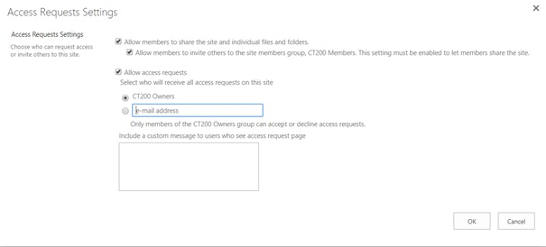
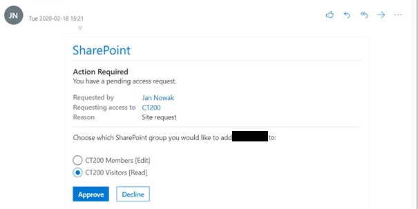
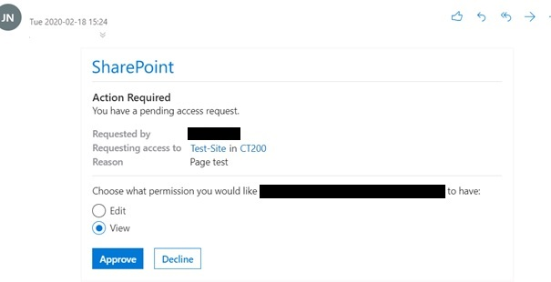
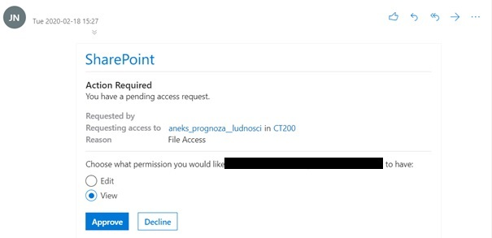
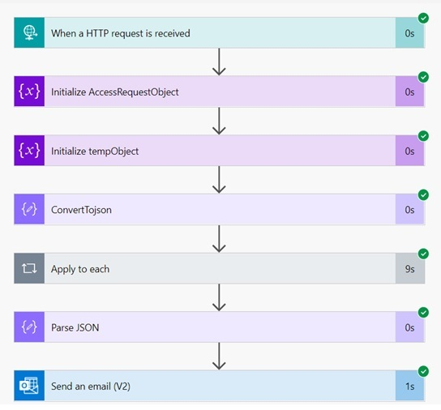
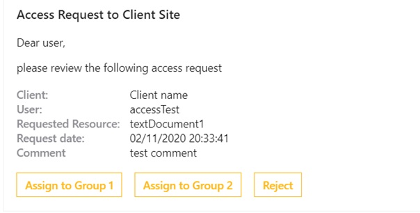
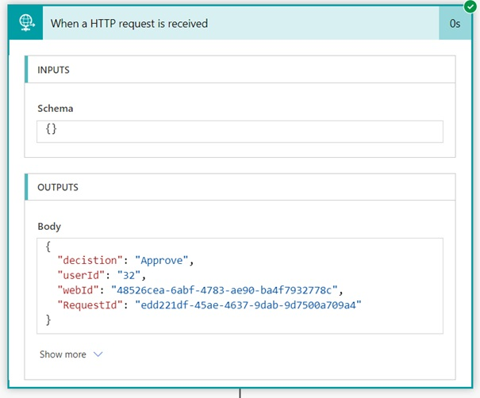

# Managing permissions: How to create custom messages for access request

## Out of the box feature 

Have you thought about any customization of the standard access request on your site? Currently, SharePoint platform provides generating a simple defined message as a solution. Management of this option is available in the pop-out window under the *Access Request Settings* button of the *Permissions* interface. 



A default format of the message for access request has its limitations. When a user requests access to a site, an owner of the resource gets the notification, represented by a compound Adaptive Card, to add the user to one of the two default groups (Members, Visitors), or to reject the request. 



In case of sending a request to get access to a certain list or item with no inherited permissions, a notification has an adapted structure and allows for providing unique access to the called resource. 





>It may happen that the *Access Request list* is not available on a site. To be sure that the object is created, you need to create at least one access request by the user with insufficient permissions to the site or one of the child component.

## Test Case Scenario

#### Business Requirements:

- messages for access request should be standardized 
- a structure of messages should be definable 
- a notification should use Microsoft Adaptive Cards 
- an opportunity to add a user to any of two predefined custom groups
- posting of messages on MS Teams application should be possible

#### The solution meeting all the requirements can be achieved in a few steps:
- Enter the *Access Request Settings* interface and enable *Allow access requests* option. Select an account to receive standard messages. Otherwise, the access requests feature is disabled. 


-	Create a Power Automate or Logic Apps workflow which will receive a HTTP request. 
-	Add a PnP event receiver to Access Requests list using the following code: 
```
Add-PnPEventReceiver -List "Access Requests" -Name "TestEventReceiver" -Url "<LogicAppURL>" -EventReceiverType ItemAdded -
Synchronization Synchronous
```
-	Update the created workflow according to the scheme and action parameters below: 



#### ConvertToJson action:

```javascript
json(xml(replace(triggerBody(), '<?xml version="1.0" encoding="UTF-8"?>', '')))
```

#### Schema of converted XML element of the request: 

```javascript
{
  "type": "object",
  "properties": {
    "s:Envelope": {
      "type": "object",
      "properties": {
        "s:Body": {
          "type": "object",
          "properties": {
            "ProcessEvent": {
              "type": "object",
              "properties": {
                "properties": {
                  "type": "object",
                  "properties": {
                    "AppEventProperties": {
                      "type": "object",
                      "properties": {
                        "@i:nil": {
                          "type": "string"
                        }
                      }
                    },
                    "ContextToken": {},
                    "CorrelationId": {
                      "type": "string"
                    },
                    "CultureLCID": {
                      "type": "string"
                    },
                    "EntityInstanceEventProperties": {
                      "type": "object",
                      "properties": {
                        "@i:nil": {
                          "type": "string"
                        }
                      }
                    },
                    "ErrorCode": {},
                    "ErrorMessage": {},
                    "EventType": {
                      "type": "string"
                    },
                    "ItemEventProperties": {
                      "type": "object",
                      "properties": {
                        "AfterProperties": {
                          "type": "object",
                          "properties": {
                            "a:KeyValueOfstringanyType": {
                              "type": "array",
                              "items": {
                                "type": "object",
                                "properties": {
                                  "a:Key": {
                                    "type": "string"
                                  },
                                  "a:Value": {
                                    "type": "object",
                                    "properties": {
                                      "#text": {
                                        "type": "string"
                                      },
                                      "@i:type": {
                                        "type": "string"
                                      },
                                      "@xmlns:b": {
                                        "type": "string"
                                      }
                                    }
                                  }
                                },
                                "required": [
                                  "a:Key",
                                  "a:Value"
                                ]
                              }
                            },
                            "@xmlns:a": {
                              "type": "string"
                            }
                          }
                        },
                        "AfterUrl": {
                          "type": "object",
                          "properties": {
                            "@i:nil": {
                              "type": "string"
                            }
                          }
                        },
                        "BeforeProperties": {
                          "type": "object",
                          "properties": {
                            "@xmlns:a": {
                              "type": "string"
                            }
                          }
                        },
                        "BeforeUrl": {},
                        "CurrentUserId": {
                          "type": "string"
                        },
                        "ExternalNotificationMessage": {
                          "type": "object",
                          "properties": {
                            "@i:nil": {
                              "type": "string"
                            }
                          }
                        },
                        "IsBackgroundSave": {
                          "type": "string"
                        },
                        "ListId": {
                          "type": "string"
                        },
                        "ListItemId": {
                          "type": "string"
                        },
                        "ListTitle": {
                          "type": "string"
                        },
                        "UserDisplayName": {
                          "type": "string"
                        },
                        "UserLoginName": {
                          "type": "string"
                        },
                        "Versionless": {
                          "type": "string"
                        },
                        "WebUrl": {
                          "type": "string"
                        }
                      }
                    },
                    "ListEventProperties": {
                      "type": "object",
                      "properties": {
                        "@i:nil": {
                          "type": "string"
                        }
                      }
                    },
                    "SecurityEventProperties": {
                      "type": "object",
                      "properties": {
                        "@i:nil": {
                          "type": "string"
                        }
                      }
                    },
                    "UICultureLCID": {
                      "type": "string"
                    },
                    "WebEventProperties": {
                      "type": "object",
                      "properties": {
                        "@i:nil": {
                          "type": "string"
                        }
                      }
                    },
                    "@xmlns:i": {
                      "type": "string"
                    }
                  }
                },
                "@xmlns": {
                  "type": "string"
                }
              }
            }
          }
        },
        "@xmlns:s": {
          "type": "string"
        }
      }
    }
  }
}
```

All properties from the request are stored in an array element. We can convert them into one JSON object using the following function inside the *Apply to each* action.

```javascript
addProperty(variables('AccessRequestObject'),item()?['a:Key'], item()?['a:Value']?['#text'])
```

#### An example of the final request object: 

```javascript
{
  "PermissionLevelRequested": "<Permission Level>",
  "PermissionType": "<Permission Type>",
  "IsInvitation": "<Is an user invited>",
  "RequestId": "<RequestId>",
  "RequestedWebId": "<WebId>",
  "RequestedForDisplayName": "<User display name>",
  "Expires": "<Expiration Date>",
  "AnonymousLinkType": "<>",
  "RequestedByDisplayName": "<Requestor display name>",
  "RequestedListItemId": "<>",
  "Status": "0",
  "RequestedObjectTitle": "<Resource name>",
  "Conversation": "<Request comment>",
  "Title": "<Request title>",
  "RequestedByUserId": "<Requestor Id",
  "PropagateAcl": "<>",
  "RequestedObjectUrl": "<Url to requested resource>, ",
  "RequestedForUserId": "User ID",
  "FileSystemObjectType": "<Resource type>",
  "RequestedListId": "<Resource List Id>",
  "InheritingRequestedWebId": "<>",
  "SendWelcomeEmail": "<>",
  "RequestedFor": "<Login of a user>",
  "RequestedBy": "<Login of a requestor>"
}
```
As you can see, the request processes a lot of useful information. In the next steps, we will make use of this data, querying i.e. *RequestedByDisplayName*, *RequestedObjectTitle*, *Conversation*, and *RequestedWebId*. 

####	An example of a message structure with Adaptive Card solution: 
```html
<html>
<head>
  <meta http-equiv="Content-Type" content="text/html; charset=utf-8">
  <script type="application/adaptivecard+json">{
    "$schema": "http://adaptivecards.io/schemas/adaptive-card.json",
    "type": "AdaptiveCard",
    "version": "1.0",
    "body": [
        {
            "type": "TextBlock",
            "text": "An access request to a Client Site",
            "weight": "Bolder",
            "size": "Medium"
        },
        {
            "type": "TextBlock",
            "text": "Dear user, \n\n please review the following access request",
            "wrap": true
        },
        {
            "type": "FactSet",
            "facts": [
                {
                    "title": "Client:",
                    "value": "Client name"
                },
                {
                    "title": "User:",
                    "value": "@{body('Parse_JSON')?['RequestedByDisplayName']}"
                },
                {
                    "title": "Requested Resource:",
                    "value": "@{body('Parse_JSON')?['RequestedObjectTitle']}"
                },
                {
                    "title": "Request date:",
                    "value": "@{utcNow()}"
                },
{
                    "title": "Comment",
                    "value": "@{body('Parse_JSON')?['Conversation']}"
                }
            ]
        }
    ],
    "actions": [
        {
            "type": "Action.Http",
            "title": "Assign to Group 1",
            "method": "POST",
            "headers": [
                {
                    "name": "Authorization",
                    "value": ""
                }
            ],
            "url": "<URL_TO_A_DECISION_FLOW>",
            "body": "{'decision':'Approve','userId':'@{body('Parse_JSON')?['RequestedForUserId']}','webId':'@{body('Parse_JSON')?['RequestedWebId']}','RequestId':'@{body('Parse_JSON')?['RequestId']}'}"
        },
        {
            "type": "Action.Http",
            "title": "Assign to Group 2",
            "method": "POST",
            "headers": [
                {
                    "name": "Authorization",
                    "value": ""
                }
            ],
            "url": "<URL_TO_A_DECISION_FLOW>",
            "body": "{'decision':'Approve2','userId':'@{body('Parse_JSON')?['RequestedForUserId']}','webId':'@{body('Parse_JSON')?['RequestedWebId']}','RequestId':'@{body('Parse_JSON')?['RequestId']}'}"
        },
        {
            "type": "Action.Http",
            "title": "Reject",
            "method": "POST",
            "headers": [
                {
                    "name": "Authorization",
                    "value": ""
                }
            ],
            "url": "<URL_TO_A_DECISION_FLOW>",
            "body": "{'decision':'Reject','userId':'@{body('Parse_JSON')?['RequestedForUserId']}','webId':'@{body('Parse_JSON')?['RequestedWebId']}','RequestId':'@{body('Parse_JSON')?['RequestId']}'}"
        }
    ]
}
  </script>
</head>
<body>
</body>
</html>
```

The HTTP action inside the Adaptive Card item allows for triggering another flow, through which we can handle a decision choice made by an authorized user. 

An example of the request body: 
```
{ 
  'decision':'Approve2',
  'userId':'@{body('Parse_JSON')?['RequestedForUserId']}',
  'webId':'@{body('Parse_JSON')?['RequestedWebId']}',
  'RequestId':'@{body('Parse_JSON')?['RequestId']}'
}``
```



The second flow will be triggered automatically, after clicking one of the provided buttons. 



In the following part of *the decision flow*, you can handle the received request in many ways, adapting the process to the specific needs and requirements of your organization. Here are some actions that can be used to complement the workflow:
- Storing dataset about the access request on a custom list 
- Generating enhanced Adaptive Card messages with undertaken decision 
- Introducing multi-stage approval route 

## Make a clean-up 

Having the new process implemented, we should remove all additional items on the default *Access Requests* list. To do so, we need to append the initially created flow with Delete actions using *ListId*, *ListItemId* and *WebUrl* properties of the set flow trigger: 

```
body('ConvertTojson')?['s:Envelope']?['s:Body']?['ProcessEvent']?['properties']?['ItemEventProperties']
```

```javascript
"ItemEventProperties":{
       "AfterProperties":{},
       "AfterUrl":{},
       "BeforeProperties":{},
       "BeforeUrl":null,
       "CurrentUserId":"1073741823",
       "ExternalNotificationMessage":{},
       "IsBackgroundSave":"false",
       **"ListId":"<LIST_ID>",**
       **"ListItemId":"<ID>",**
       "ListTitle":"Access Requests",
       "UserDisplayName":"System Account",
       "UserLoginName":"SHAREPOINT\\system",
       "Versionless":"false",
       **"WebUrl":"<WebUrl>"**
 }
 ```
  
  These values allow us to create a simple REST request to remove unnecessary items. 


---

Author: Michał Kornet [LinkedIn](https://www.linkedin.com/in/micha%C5%82-kornet-sharepoint-dev/)

Co-Author: Olga Staszek [LinkedIn](https://www.linkedin.com/in/olga-staszek-2ba909b2/)
