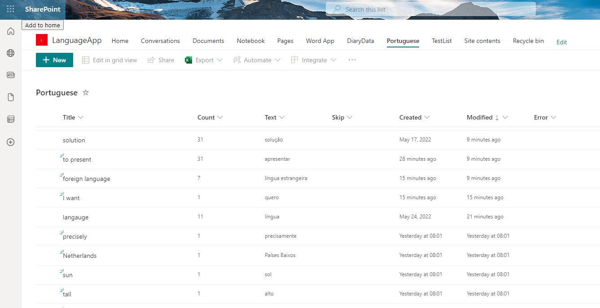
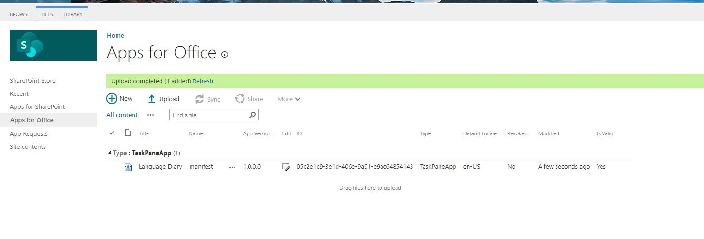
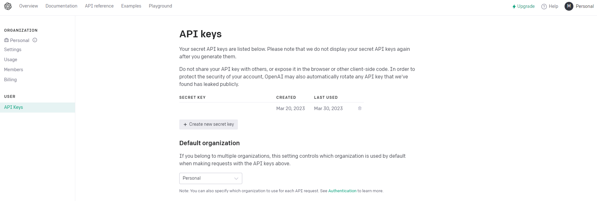
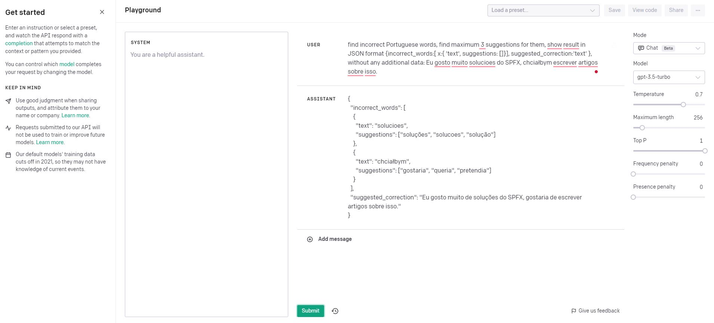
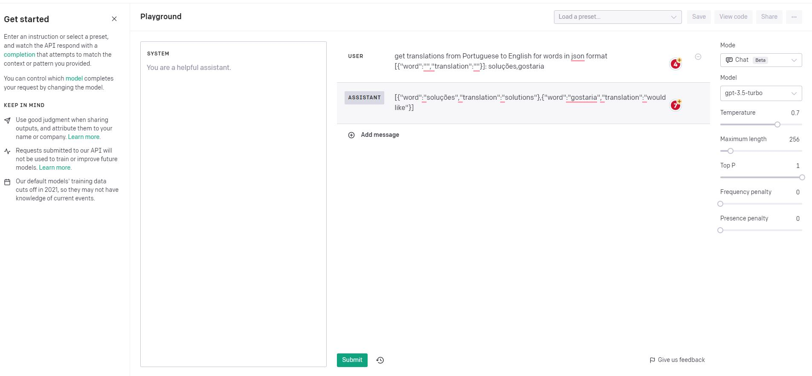
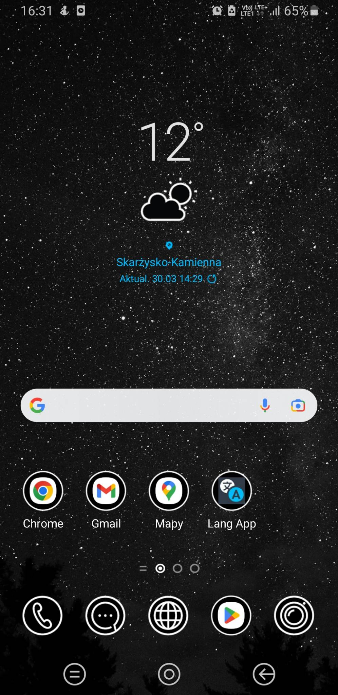
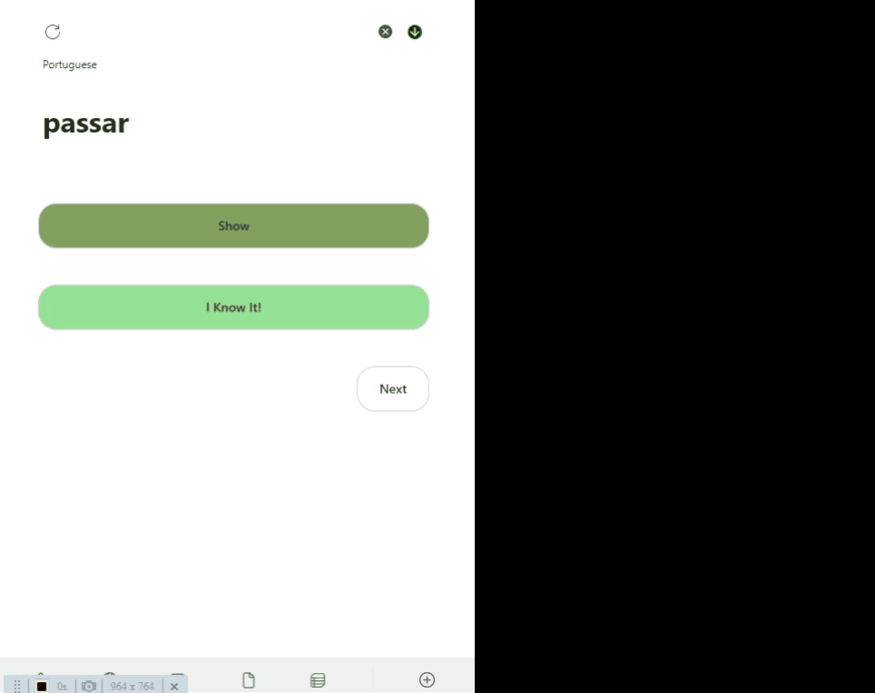

# My Language Learning Platform

1. [Introduction](#introduction)
2. [Description of Components Used](#components-used)
3. [MS Word App](#ms-word-app)
4. [Connection to Language Services](#connection-to-language-services)
5. [PWA App](#the-pwa-app)

## Introduction

Some time ago, I set myself a goal to learn new languages, recognizing that carrying basis of a native language of any visited country makes the entire trip a truly unique experience. For such communication skills, acquiring a fundamental vocabulary and understanding grammar rules are essential. 

I began my language-learning journey many years ago by using popular language apps to learn Spanish. While these apps are a great starting point, I realized that I lacked some range of vocabulary, which hindered my ability to have basic, day-to-day conversations. 

To remedy this, I decided to focus on becoming acquainted with the most common words first (e.g. a set of top 1000 popular words) before jumping into more advanced vocabulary. While there are many glossaries available online, I found that creating my own personalized list of words I utilize on a daily basis could be way more effective. We all have our own language structures that make us unique and allow to address the topics we care the most about. 

This idea inspired me to create a diary app that analyses my texts to identify incorrect words which are then stored in my personal database. This way, I am able to learn on a regular basis and track my progress in mastering new words in a foreign language. By focusing on the most common words first and creating more and more complicated texts with time, my vocabulary is quickly expanded and my general language skills visually improved.

In the tool, you can practice writing whole texts in any eligible language and fill in any unknown expressions with words or phrases from the other language - even your native one! The tool analyzes the input and suggests corrections for individual words, as well as the entire text. Furthermore, any new words can be added to a personal dictionary for a later review.


[Link to the Solution]()

## Components used 

With the clear plan in mind, I set out to explore services offered by Microsoft 365. I started with the **Office JS app for MS Word** and the **SPFx app**. 

Since the solution did not require a sophisticated database, I decided to store my data on a **SharePoint List** in my tenant site. Following this approach, I was able to gather and access my data without a need to invest significant time and effort in setting up a complex system. 



## MS Word App 

During my research, I discovered that while an [SPFx app was available for MS Outlook](https://www.youtube.com/watch?v=46J3SVzZem8), it was not for other MS Office apps. However, after further investigation, I found another solution that would allow me to render a SharePoint page with an SPFx web part using sideloading of Office JS solutions. 

Thus, following the steps listed below, I was able to successfully integrate the SPFx app across multiple tools from the Microsoft Office stack.

To use SPFx SharePoint app on MS Word, you need to:

### 1. Configure Manifest 
Replace TENANT_NAME with a name of your tenant
Replace PAGE_URL with a URL to your page (/sites/SiteName/SitePages/Test.aspx)
Replace ICONS_LIBRARY with a Url to the icons library (sites/SiteName/Shared%20Documents)

```xml
<?xml version="1.0" encoding="UTF-8" standalone="yes"?>
<OfficeApp xmlns="http://schemas.microsoft.com/office/appforoffice/1.1"
  xmlns:xsi="http://www.w3.org/2001/XMLSchema-instance"
  xmlns:bt="http://schemas.microsoft.com/office/officeappbasictypes/1.0"
  xmlns:ov="http://schemas.microsoft.com/office/taskpaneappversionoverrides" xsi:type="TaskPaneApp">
  <Id>05c2e1c9-3e1d-406e-9a91-e9ac64854143</Id>
  <Version>1.0.0.0</Version>
  <ProviderName>mknet</ProviderName>
  <DefaultLocale>en-US</DefaultLocale>
  <DisplayName DefaultValue="Language Diary"/>
  <Description DefaultValue="The tool to learn new words"/>
  <IconUrl DefaultValue="https://localhost:3000/assets/icon-32.png"/>
  <HighResolutionIconUrl DefaultValue="https://localhost:3000/assets/icon-64.png"/>
  <SupportUrl DefaultValue="https://www.contoso.com/help"/>
  <AppDomains>
    <AppDomain>login.windows.net</AppDomain>
    <AppDomain>login.microsoftonline.com</AppDomain>
    <AppDomain>TENANT_NAME.sharepoint.com</AppDomain>
    <AppDomain>outlook.office.com</AppDomain>
    <AppDomain>TENANT_NAME-my.sharepoint.com</AppDomain>
  </AppDomains>
  <Hosts>
    <Host Name="Document"/>
  </Hosts>
  <DefaultSettings>
    <SourceLocation DefaultValue="https://TENANT_NAME.sharepoint.com"/>
  </DefaultSettings>
  <Permissions>ReadWriteDocument</Permissions>
  <VersionOverrides xmlns="http://schemas.microsoft.com/office/taskpaneappversionoverrides" xsi:type="VersionOverridesV1_0">
    <Hosts>
      <Host xsi:type="Document">
        <DesktopFormFactor>
          <GetStarted>
            <Title resid="GetStarted.Title"/>
            <Description resid="GetStarted.Description"/>
            <LearnMoreUrl resid="GetStarted.LearnMoreUrl"/>
          </GetStarted>
          <FunctionFile resid="Commands.Url" />
          <ExtensionPoint xsi:type="PrimaryCommandSurface">
            <OfficeTab id="TabHome">
              <Group id="CommandsGroup">
                <Label resid="CommandsGroup.Label" />
                <Icon>
                  <bt:Image size="16" resid="Icon.16x16" />
                  <bt:Image size="32" resid="Icon.32x32" />
                  <bt:Image size="80" resid="Icon.80x80" />
                </Icon>
                <Control xsi:type="Button" id="TaskpaneButton">
                  <Label resid="TaskpaneButton.Label" />
                  <Supertip>
                    <Title resid="TaskpaneButton.Label" />
                    <Description resid="TaskpaneButton.Tooltip" />
                  </Supertip>
                  <Icon>
                    <bt:Image size="16" resid="Icon.16x16" />
                    <bt:Image size="32" resid="Icon.32x32" />
                    <bt:Image size="80" resid="Icon.80x80" />
                  </Icon>
                  <Action xsi:type="ShowTaskpane">
                    <TaskpaneId>ButtonId1</TaskpaneId>
                    <SourceLocation resid="Taskpane.Url" />
                  </Action>
                </Control>
              </Group>
            </OfficeTab>
          </ExtensionPoint>
        </DesktopFormFactor>
      </Host>
    </Hosts>
    <Resources>
      <bt:Images>
        <bt:Image id="Icon.16x16" DefaultValue="https://TENANT_NAME.sharepoint.com/ICONS_LIBRARY/icon-16.png"/>
        <bt:Image id="Icon.32x32" DefaultValue="https://TENANT_NAME.sharepoint.com/ICONS_LIBRARY/icon-32.png"/>
        <bt:Image id="Icon.80x80" DefaultValue="https://TENANT_NAME.sharepoint.com/ICONS_LIBRARY/icon-80.png"/>
      </bt:Images>
      <bt:Urls>
        <bt:Url id="GetStarted.LearnMoreUrl" DefaultValue="https://go.microsoft.com/fwlink/?LinkId=276812" />
        <bt:Url id="Commands.Url" DefaultValue="https://TENANT_NAME.sharepoint.com/PAGE_URL" />
        <bt:Url id="Taskpane.Url" DefaultValue="https://TENANT_NAME.sharepoint.com/PAGE_URL" />
      </bt:Urls>
      <bt:ShortStrings>
        <bt:String id="GetStarted.Title" DefaultValue="Get started with Language Tools" />
        <bt:String id="CommandsGroup.Label" DefaultValue="Language Tools" />
        <bt:String id="TaskpaneButton.Label" DefaultValue="Language Diary" />
      </bt:ShortStrings>
      <bt:LongStrings>
        <bt:String id="GetStarted.Description" DefaultValue="Language Diary" />
        <bt:String id="TaskpaneButton.Tooltip" DefaultValue="Click to Show a Language Diary analisis" />
      </bt:LongStrings>
    </Resources>
  </VersionOverrides>
</OfficeApp>
```

### 2. Add OfficeJS script to SPFx solution 

``` javascript

protected async onInit(): Promise<void> {

{...}

await SPComponentLoader.loadScript('https://appsforoffice.microsoft.com/lib/1/hosted/office.js', { globalExportsName: 'Office' })

{...}
  
}

```

### 3. Install Typings to SPFx solution

npm i -save-dev @types/office-js to the solution

### 4. Add the addin Manifest to the App Catalog



### 5. Add the SPFx web part to any page with the SingleApp layout

Update your PAGE_URL value in the manifest file with the URL of the page where you added the web part.

## Connection to the language services 

When selecting a main platform to carry my language learning project, I chose **MS Word** because of its native functionality of a language checker. This feature automatically highlights any incorrect words, adding an additional class (*SpellingErrorV2Themed*) that made it easy for me to grab a list of elements with this class using an OfficeJS function [body.getHtml()](https://learn.microsoft.com/en-us/javascript/api/word/word.body?view=word-js-preview#word-word-body-gethtml-member(1)) . 

Nonetheless, I encountered a roadblock when this method [stopped working](https://github.com/OfficeDev/office-js/issues/2898#issuecomment-1279839683) in a new release. Despite trying other services, I was unable to find a satisfactory solution, until I discovered **OpenAI**. 

With this powerful tool, I was able to detect incorrect words, receive suggestions for correcting them, and even get suggestions for the entire text introduced. Additionally, I could use the same tool to get translations of selected words.

In both cases, the same query gets a result in a stable JSON format. Fortunately, OpenAI handles such requests well. Feel free to test your own queries [here](https://platform.openai.com/playground). The important thing is to use the correct syntax of results. To achieve this, I used the following text at the end of the query.
*`how result in JSON format {incorrect_words:[ x:{ 'text', suggestions: []}], suggested_correction:'text' }`*.  

To get the apiKey, you need to create an account on the OpenAI website and create a new one on the [page](https://platform.openai.com/account/api-keys). 


### Query for incorrect words
In the code, I replace the *language* property with a name of language used, and the *text* property with a written text in the Word document.
`find incorrect ${language} words, find maximum 3 suggestions for them, show result in JSON format {incorrect_words:[ x:{ 'text', suggestions: []}], suggested_correction:'text' }, without any additional data: ${text}`




### Translations query
Also the *wordsToTranslate* property is replaced with selected words separated by comma.
`get translations from Portuguese to English for words in json format [{"word":"","translation":""}]: ${wordsToTranslate}`



I use the following code to connect to the OpenAI API, get suggestions and corrected text. 

``` javascript
public async checkSpelling(text: string, language: string): Promise<ITextCheckResult> {
        try {
            const apiKey = ConstantsApi.ChatGPTApiKey;
            const apiUrl = 'https://api.openai.com/v1/chat/completions';
            const query = `find incorrect ${language} words, find maximum 3 suggestions for them,
         show result in JSON format {incorrect_words:[ x:{ 'text', suggestions: []}], suggested_correction:'text' },
         without any additional data: ${text}`;

            const response = await fetch(apiUrl, {
                body: JSON.stringify(
                    {
                        frequency_penalty: 0,
                        max_tokens: 2048,
                        model: 'gpt-3.5-turbo',
                        presence_penalty: 0,
                        temperature: 0,
                        top_p: 1,
                        messages: [{
                            role: 'assistant',
                            content: query
                        }
                        ]
                    }),
                headers: { 'Authorization': `Bearer ${apiKey}`, 'Content-Type': 'application/json' },
                method: 'POST'
            });

            const jsonResponse = await response.json();

            const result = jsonResponse && jsonResponse.choices && jsonResponse.choices.length > 0
                && jsonResponse.choices[0].message &&
                jsonResponse.choices[0].message.content ? JSON.parse(jsonResponse.choices[0].message.content) : null;

            if (!result || !result.incorrect_words) {
                return {
                    incorrectWords: [],
                    suggestedText: null
                };
            }

            const incorrectWords = result.incorrect_words.map(
                (incorrectWord) => {
                    return { word: incorrectWord.text, suggestions: incorrectWord.suggestions, token: incorrectWord.text } as IIncorrectWord;
                });
            return {
                incorrectWords: incorrectWords,
                suggestedText: result.suggested_correction
            };
        } catch (error) {
            console.error('Error in checkSpelling', e);
        }
    }
```


I used the following code to connect to the OpenAI API and get translations for selected words. 

``` javascript
 public async getTranslationsForWords(words: IWordToAnalyze[]): Promise<IWordToAnalyze[]> {
        try {
            const apiKey = ConstantsApi.ChatGPTApiKey;
            const apiUrl = 'https://api.openai.com/v1/chat/completions';

            const wordsToTranslate = words.filter((word) => word.isChecked).map((word) => word.title).join(',');
            const query = `get translations from Portuguese to English for words in json format [{"word":"","translation":""}]: ${wordsToTranslate}`;

            const response = await fetch(apiUrl, {
                body: JSON.stringify(
                    {
                        frequency_penalty: 0,
                        max_tokens: 2048,
                        model: 'gpt-3.5-turbo',
                        presence_penalty: 0,
                        temperature: 0,
                        top_p: 1,
                        messages: [{
                            role: 'assistant',
                            content: query
                        }
                        ]
                    }),
                headers: { 'Authorization': `Bearer ${apiKey}`, 'Content-Type': 'application/json' },
                method: 'POST'
            });

            const jsonResponse = await response.json();

            const result = jsonResponse && jsonResponse.choices && jsonResponse.choices.length > 0
                && jsonResponse.choices[0].message &&
                jsonResponse.choices[0].message.content ? JSON.parse(jsonResponse.choices[0].message.content) : null;

            if (!result || result.length === 0) {
                return words;
            }

            const wordsWithTranslation = words.map(
                (word) => {
                    if (!!word.translation) { return word; }
                    const translationItem = find(result, (item) => item.word === word.title);
                    return { ...word, translation: translationItem ? translationItem.translation : null } as IWordToAnalyze;
                });

            return wordsWithTranslation;
        }
        catch (e) {
            console.error('Error in getTranslationsForWords', e);
        }
    }
```


## The PWA app


As an additional aid in my language learning journey, I decided to create a simple flashcard app I could access easily on my phone. I used a service worker script and the PWA solution, which allowed me to create a convenient shortcut on the mobile home screen. The article [Progressive WebApp in SharePoint - the supported way](http://www.msclouddeveloper.com/progressive-webapp-in-sharepoint/) was very helpful in this regard. For the full extension code, please see the [GitHub repository](https://github.com/mkm17/pwa-extension).

**manifest.webmanifest file**
``` javascript
{
    "theme_color": "#323c48",
    "background_color": "#323c48",
    "display": "standalone",
    "scope": "/",
    "id":"/sites/LanguageApp/",
    "start_url": "<<LINK TO THE PAGE>>",
    "name": "Language App",
    "short_name": "Lang App",
    "description": "desc",
    "icons": [
        {
            "src": "<<PATH TO THE ICON LIBRARY>>/icon-192x192.png",
            "sizes": "192x192",
            "type": "image/png"
        },
        {
            "src": "<<PATH TO THE ICON LIBRARY>>/icon-256x256.png",
            "sizes": "256x256",
            "type": "image/png"
        },
        {
            "src": "<<PATH TO THE ICON LIBRARY>>/icon-384x384.png",
            "sizes": "384x384",
            "type": "image/png"
        },
        {
            "src": "<<PATH TO THE ICON LIBRARY>>/icon-512x512.png",
            "sizes": "512x512",
            "type": "image/png"
        }
    ]
}

**sw.js service worker**
``` javascript

/*
 Copyright 2016 Google Inc. All Rights Reserved.
 Licensed under the Apache License, Version 2.0 (the "License");
 you may not use this file except in compliance with the License.
 You may obtain a copy of the License at
 http://www.apache.org/licenses/LICENSE-2.0
 Unless required by applicable law or agreed to in writing, software
 distributed under the License is distributed on an "AS IS" BASIS,
 WITHOUT WARRANTIES OR CONDITIONS OF ANY KIND, either express or implied.
 See the License for the specific language governing permissions and
 limitations under the License.
 */

// Names of the two caches used in this version of the service worker.
// Change to v2, etc. when you update any of the local resources, which will
// in turn trigger the install event again.
const PRECACHE = 'precache-v1';
const CACHE_NAME = 'runtime_v1';

// A list of local resources we always want to be cached.
const PRECACHE_URLS = [
  '/'
];

// The install handler takes care of precaching the resources we always need.
self.addEventListener('install', event => {
  event.waitUntil(
    caches.open(PRECACHE)
      .then(cache => cache.addAll(PRECACHE_URLS))
      .then(self.skipWaiting())
  );
});

// The activate handler takes care of cleaning up old caches.
self.addEventListener('activate', event => {
  const currentCaches = [PRECACHE, CACHE_NAME];
  event.waitUntil(
    caches.keys().then(cacheNames => {
      return cacheNames.filter(cacheName => !currentCaches.includes(cacheName));
    }).then(cachesToDelete => {
      return Promise.all(cachesToDelete.map(cacheToDelete => {
        return caches.delete(cacheToDelete);
      }));
    }).then(() => self.clients.claim())
  );
});

self.addEventListener('fetch', event => {
    event.respondWith(
      caches.match(event.request)
        .then(response => {
          if (response) {
            return response;
          } else {
            return fetch(event.request)
              .then(response => {
                const clonedResponse = response.clone();
                caches.open(CACHE_NAME)
                  .then(cache => {
                    const cacheKey = event.request.url;
                    cache.put(cacheKey, clonedResponse);
                  });
                return response;
              })
              .catch(error => {
                console.error('Failed to fetch from network:', error);
                // Fallback to a custom offline page
                return caches.match('/offline.html');
              });
          }
        })
    );
  });
```



While this solution worked pretty well, I encountered an issue when trying to use the app offline and in the flight mode.



Up till now, I have only found a partial solution to this case, involving rendering the flashcards page first and then caching all necessary requests. This allows me to view the flashcards without additional requests requiring Internet connections. 


---

I hope you enjoyed this article and found it useful for your case. If you have any questions or comments, reach out to me on [Linkedin](https://www.linkedin.com/in/micha%C5%82-kornet-sharepoint-dev/) .

